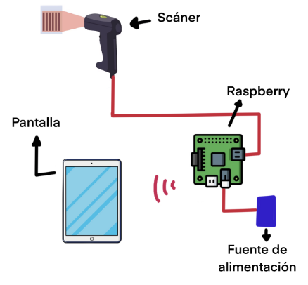
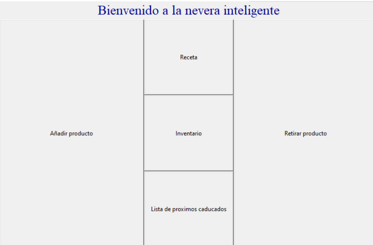
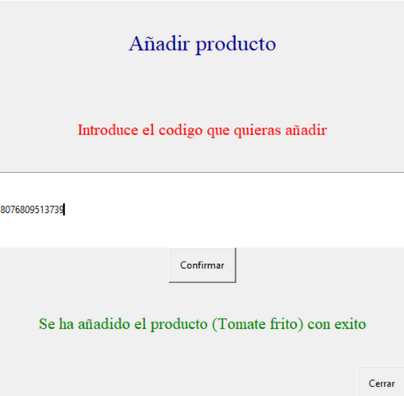
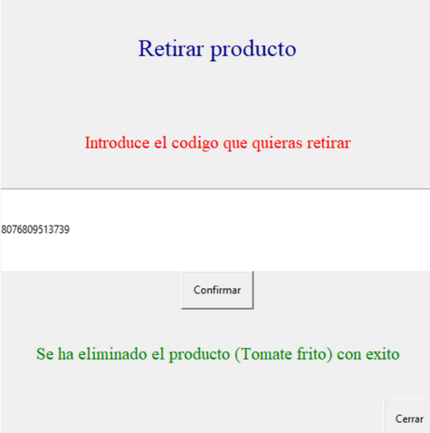
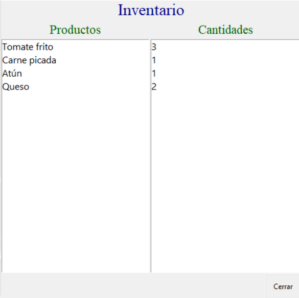
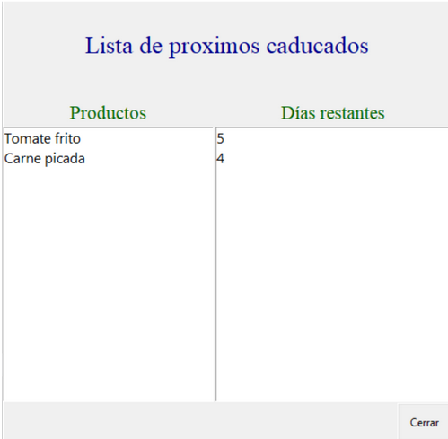
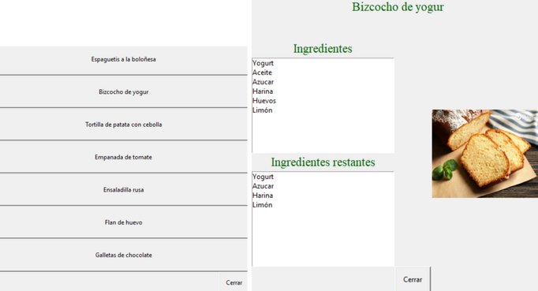

# 🧊 Smart-fridge-inventory

Este proyecto es un prototipo simplificado de una nevera inteligente capaz de escanear productos al ser añadidos o retirados, mantener un inventario digital y mostrar recetas sugeridas en base al contenido disponible.

Grado en Inteligencia Robótica — Universitat Jaume I (UJI)

Asignatura: Diseño de Sistemas Empotrados y de Tiempo Real (IR2162)

Fecha: Marzo 2024


---

## 🧠 Objetivo del prototipo

El propósito de este sistema es simular cómo podría funcionar una nevera doméstica con inteligencia integrada.
El prototipo permite:

* Escanear productos mediante un lector de código de barras.
* Actualizar automáticamente el inventario al añadir o retirar productos.
* Visualizar los productos próximos a caducar.
* Consultar recetas y saber qué ingredientes faltan.
* Controlar todo el sistema de forma remota, usando una tablet o PC conectado por WiFi.

---

## ⚙️ Componentes usados

### 🔩 Hardware

* Raspberry Pi 2 o superior
* Escáner de código de barras (USB)
* Fuente de alimentación 5V
* Dispositivo con WiFi (tablet, portátil o smartphone)
* (Opcional) Monitor HDMI, teclado y ratón para la primera configuración

### 💾 Software

* Raspberry Pi OS (64-bit)
* Raspberry Pi Imager (para instalar el sistema operativo)
* VNC Viewer (RealVNC) para el control remoto
* Python 3 y librerías necesarias:

  ```bash
  pip install guizero
  ```

---

## 🧱 Montaje del sistema

1. Conecta el escáner de código de barras a un puerto USB de la Raspberry Pi.
2. Alimenta la Raspberry con una fuente de 5V por micro-USB.
3. Asegúrate de que la Raspberry y el dispositivo desde el que la controlarás están conectados a la misma red WiFi.



---

## 🧩 Configuración del entorno en la Raspberry Pi

### 1. Instalar el sistema operativo

Descarga e instala Raspberry Pi OS (64-bit) con Raspberry Pi Imager desde tu PC.
Selecciona:

* Sistema operativo: *Raspberry Pi OS (64-bit)*
* Almacenamiento: tu tarjeta microSD
* En “Opciones avanzadas”, activa:

  * WiFi (nombre y contraseña de tu red)
  * SSH
  * Usuario y contraseña predeterminados

Inserta la tarjeta en la Raspberry y arráncala.

---

### 2. Configurar el acceso remoto con VNC

Para visualizar y controlar la interfaz de la nevera desde otro dispositivo:

1. Abre el menú principal de la Raspberry → Preferencias > Configuración de Raspberry Pi.
2. En la pestaña Interfaces, activa VNC.
3. Instala *RealVNC Viewer* en tu tablet o PC.
4. Conéctate a la Raspberry introduciendo la dirección IP local (visible en la barra superior o usando `hostname -I` en terminal).
5. Inicia sesión con el usuario y contraseña configurados.

> Desde este momento podrás ver y manejar el escritorio de la Raspberry sin necesidad de monitor ni teclado físicos.

---

## 🚀 Despliegue y ejecución

1. Clona este repositorio en tu Raspberry Pi:

   ```bash
   git clone https://github.com/inesperez03/nevera-inteligente.git
   ```

2. Instala dependencias:

3. Ejecuta el programa principal:

   ```bash
   python3 smart_fridge/code.py
   ```

4. Se abrirá una interfaz gráfica con el menú principal, accesible también desde tu tablet o PC a través del **VNC Viewer**.

---

## 🪟 Ventanas de la aplicación

El programa cuenta con **cinco ventanas principales** además del menú inicial, todas accesibles desde la GUI desarrollada con **guizero**.

### 1. 🏠 Menú principal

Desde aquí se puede acceder a todas las funciones del sistema.




---

### 2. ➕ Añadir producto

Permite escanear y registrar un producto nuevo en el inventario, calculando su fecha estimada de caducidad.



---

### 3. ➖ Retirar producto

Elimina productos o reduce su cantidad en el inventario.



---

### 4. 📋 Inventario

Muestra la lista de productos almacenados y la cantidad disponible de cada uno.



---

### 5. ⏳ Caducidad próxima

Lista los productos cuya fecha de caducidad es inferior a 7 días.



---

### 6. 🍳 Recetas

Ofrece una lista de recetas predefinidas y muestra qué ingredientes faltan según el inventario.
Cada receta abre una subventana con los ingredientes disponibles, los que faltan y una imagen ilustrativa del plato.



---


## ✉️ Autores
Inés Pérez Edo – github.com/inesperez03


Joel Ramos Beltrán - github.com/JoelRamosBeltran
